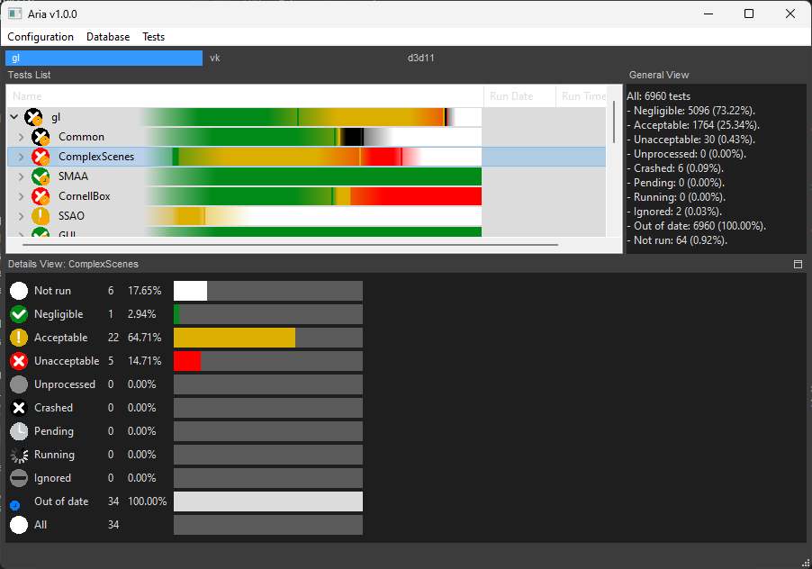
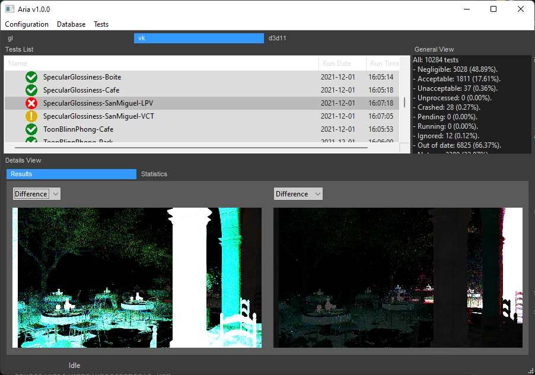
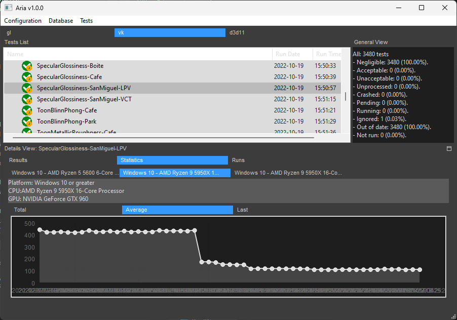

# Aria

Aria is a render tests manager I've written while developping Castor3D.  
I've created its own repository to be able to extend it to any engine that could make use of it.  
It relies on a test launcher that engine developers needs to write.  

## Build Info

- Aria depends on wxWidgets and sqlite.  

## Contact

You can reach me on the Discord server dedicated to my projects: [DragonJoker's Lair](https://discord.gg/NuTFAh55G6)

## Screenshots

